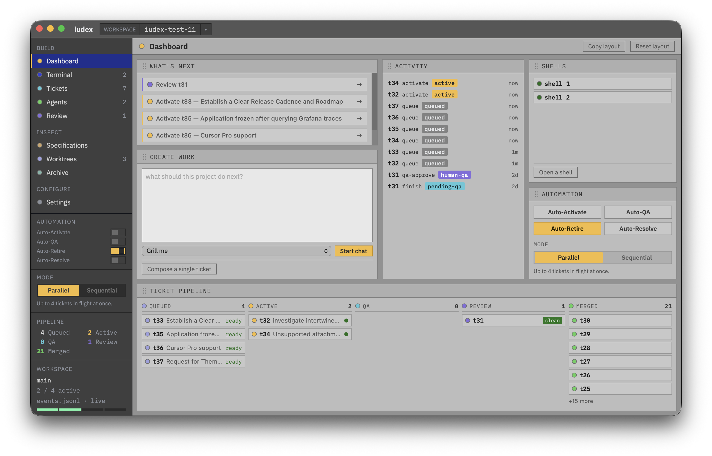

<!-- <p align="center">
  
</p> -->

<h1 align="center">iudex</h1>

<p align="center">
  <strong>Describe what to build. Harden your plan. Let agents do the work. Review what ships.</strong>
</p>

<p align="center">
  A desktop app for running AI coding agents like an engineering team: in parallel, under review, on plain git.
</p>

<p align="center">
  <a href="https://github.com/rengwu/iudex/releases"></a>
  <a href="https://github.com/rengwu/iudex/stargazers"></a>
  
  
</p>

<p align="center">
  
</p>

---

## What is iudex?

iudex is a desktop app that turns AI coding agents into a team. You describe work as tickets, harden the plan through bundled skills, and let agents implement each ticket in its own git worktree. A QA agent reviews every diff before it reaches you, and the final merge is always your decision.

Under the hood, the app is a thin client over a small Go CLI. There is no daemon, no database, and no automatic merge. State lives in an append-only `.iudex/events.jsonl`; the worktrees, branches, and diffs are plain git.

## Why use it?

One agent in one terminal is simple. Running several agents at once gets messy: overlapping branches, unclear review state, and a `main` branch you stop trusting. iudex adds just enough structure to keep many agents productive without becoming another agent itself.

For engineers, iudex means parallel agents in isolated worktrees, a terminal into any live session, and a diff before anything lands. For owners and managers, it means requirements and progress as tickets moving through a pipeline, so they can see what is blocked on them and gate what ships without reading every line. The branches and history are real git, so there is no lock-in.

## Features

The GUI is built around seven views:

| View | What it does |
| ---- | ------------ |
| **Dashboard** | Next-action hero, the pipeline as clickable columns, an idea launcher, and a live event feed. |
| **Terminal** | Tabbed, interactive tmux sessions that survive view switches. |
| **Tickets** | Reactive table with state-aware actions and front-of-funnel launchers. |
| **Agents** | Live `capture-pane` peeks into each agent, with synthesized status. |
| **Worktrees** | Per-worktree diff inspection with escape hatches into your editor or a shell. |
| **Review** | The human gate: brief, log, QA notes, diff, and a preflighted approve and merge. |
| **Settings** | Agent commands, prompts, and per-workspace config. |

Beyond the views:

- **Parallel by design.** Each agent gets one git worktree and one branch. They do not collide.
- **A real review gate.** A QA agent reviews before you do; the final merge is always your call.
- **Opt-in automation.** Auto-activate, auto-QA, auto-retire, and auto-resolve are armed individually and session-only, so a launch never spends tokens on its own.
- **Sequential mode.** A workspace policy that caps you at one ticket in flight.
- **Agent-agnostic.** Claude Code, Aider, or any command-line agent you configure through `~/.iudex/config.yml`.
- **Git-native and event-sourced.** No daemon, no database. Delete the app and your history is still git.

## Install

### Desktop app (recommended)

Grab the latest build from [**Releases**](https://github.com/rengwu/iudex/releases):

| Platform | Asset |
| -------- | ----- |
| macOS (Apple Silicon) | `.dmg` |
| Linux (x86_64) | `.AppImage` |

The app bundles the CLI as a sidecar, so no separate setup is needed. It requires [tmux](https://github.com/tmux/tmux) 3.2 or newer for the Terminal and Agents views. To build from source, see [`gui/README.md`](./gui/README.md).

### CLI only

A standalone Go binary for power users, scripts, or CI. The only runtime dependency is `git`.

```bash
go build -o iudex .
```

Cross-compilation works the same as any Go program:

```bash
GOOS=linux GOARCH=arm go build -o iudex-arm .
```

Requires Go 1.22 or newer. Dependencies are `github.com/spf13/cobra` and `gopkg.in/yaml.v3`.

## Quick start

Open the desktop app, point it at any git repo, and click **Open**. If the folder has no workspace, the app offers to run `iudex init` in place. From the Dashboard you can compose a ticket, activate it, and let the app spawn an agent and track it through to review.

The same pipeline from the terminal:

```bash
cd ~/code/my-project

iudex init                           # scaffold .iudex/ in the repo

vim .iudex/queue/t$(iudex next-ticket-id).md
iudex queue t1                       # register the ticket

iudex activate t1                    # create the worktree and print the agent spawn command
# paste the command to start an agent in the new worktree

iudex finish                         # from inside the worktree: hand off to QA
iudex qa approve                     # or: iudex qa reject

iudex review t1                      # brief, log, diff, QA review, next actions
iudex human-qa approve t1            # merge to main, archive, and remove the worktree
```

Use `iudex status` at any time to see the board. Add dependencies with `--deps`:

```bash
iudex queue t2 --deps t1,t3
```

Dependencies must already be registered, which keeps the graph acyclic by construction.

## How it works

```
(none) --queue--> queued
queued --activate--> active
active --finish--> pending-qa
pending-qa --qa approve--> pending-human-qa
pending-qa --qa reject--> active  (or failed at the reject limit)
pending-human-qa --human-qa approve--> done
pending-human-qa --human-qa reject--> active
failed --retry--> active
<any non-terminal> --remove--> removed
```

A ticket is only `done` after you approve the merge. If QA rejects a ticket too many times, it moves to `failed` and waits for `iudex retry`. If you reject it, it goes back to `active` with your reason appended to the review notes.

## The CLI

The GUI and the terminal are two front-ends to the same engine. Agents inside a worktree call these commands directly.

| Command | Description |
| ------- | ----------- |
| `iudex init` | Scaffold the current directory into a workspace |
| `iudex next-ticket-id` | Print the next ticket id |
| `iudex queue <id> [--deps <ids>]` | Register a ticket and its dependencies |
| `iudex activate <id>` | Create the worktree and print the impl spawn command |
| `iudex finish [id]` | Hand off to QA; auto-commits if dirty; id inferred from the worktree |
| `iudex spawn [id]` | Reprint the spawn command for a ticket's current state |
| `iudex qa approve\|reject [id]` | Agent QA decision |
| `iudex human-qa approve\|reject <id>` | Merge, or send back for revision with `--reason` |
| `iudex retry <id>` | Reset a failed ticket for another attempt |
| `iudex remove <id>` | Abandon a ticket |
| `iudex review <id>` | Print brief, log, diff, QA review, state, and next actions |
| `iudex status [--all] [--json]` | Tickets grouped by state; `--json` is machine-readable |
| `iudex config [--json]` | Print the resolved config |
| `iudex agent-command <role>` | Print the agent command resolved for a role |

`finish`, `qa`, and `spawn` can infer the ticket from the current worktree directory. An explicit id always overrides.

## Shaping the work

The pipeline starts at `iudex queue`. Turning a raw idea into sliced, dependency-ordered tickets is handled by bundled skills that `iudex init` scaffolds into `.iudex/skills/` and indexes in a tracked `AGENTS.md`:

- `grill-me` / `grill-with-docs` — interrogate a plan until it holds up; the docs variant maintains a glossary and ADRs.
- `prototype` — throwaway code to validate a design first.
- `to-prd` — synthesize the discussion into a PRD.
- `to-issues` — slice a plan into tickets and register them with their dependencies.
- `improve-codebase-architecture` — surface refactors that feed back into the funnel.

Shared project docs live in `.context/` (glossary, ADRs, PRDs). Because this directory is tracked, it is visible inside every worktree, so the implementation and QA agents share the same domain language.

## Configuration

Workspace settings live in `.iudex/config.yml`:

| Field | Meaning |
| ----- | ------- |
| `main_branch` | Merge target (the repo's current branch at init) |
| `max_active` | Cap on tickets in `active` state (`0` = unlimited) |
| `qa_reject_limit` | QA rejections before a ticket is `failed` (`<= 0` = unlimited) |
| `merge_strategy` | `no-ff` or `squash` |
| `merge_message_template` | Merge commit message; `{{.Ticket}}` is substituted |
| `branch_prefix` | Per-ticket branch prefix (e.g. `work/`) |

Agent commands are machine-level, so they live in `~/.iudex/config.yml` and are shared across workspaces:

| Field | Meaning |
| ----- | ------- |
| `agent_commands` | Pool of named commands (`name`, `command`, `default`) |
| `agent_roles` | Map a role (`impl`, `qa`, `resolve`, `idea`, ...) to a pool entry |
| `iudex_bin` | Path to the iudex CLI (used by the GUI) |

`iudex agent-command <role>` resolves a role to a command, so scripts and the GUI use the same rule as the CLI. The pool must contain at least one command; there is no built-in default.

Prompt templates injected into spawn commands are stored at `.iudex/prompts/impl.md` and `.iudex/prompts/review.md`.

## Under the hood

- **One source of truth.** All state, dependencies, and the QA-reject counter are derived by replaying `.iudex/events.jsonl`. The file is written with `O_APPEND`, so concurrent writes are safe.
- **In-place workspace.** iudex runs inside your project, like `git`. Everything it owns is under `.iudex/`, which is gitignored. The repo root stays on the canonical `main` branch.
- **Real git worktrees.** Each ticket gets a branch named `<branch_prefix><id>`. The `.task/` directory inside the worktree is ignored through the shared git exclude, so it never pollutes a tracked `.gitignore` or a merge.
- **The GUI holds no authoritative state.** It reads via `iudex status --json`, writes by shelling the CLI, and watches `events.jsonl` as a doorbell. It owns the one thing the CLI deliberately does not: agent process supervision through a tmux pool.
- **All git operations use `exec.Command`.** No libgit2 dependency; it works wherever `git` is installed.

## Contributing

Issues and PRs are welcome. The CLI is the Go module at the root; the GUI is the separate project under `gui/`.

```bash
# CLI
go test ./...

# GUI
cd gui
pnpm install
pnpm tauri dev
```

Before submitting, make sure the CLI tests pass and the GUI builds.

<!-- TODO: add a LICENSE file and a License section before going public -->
